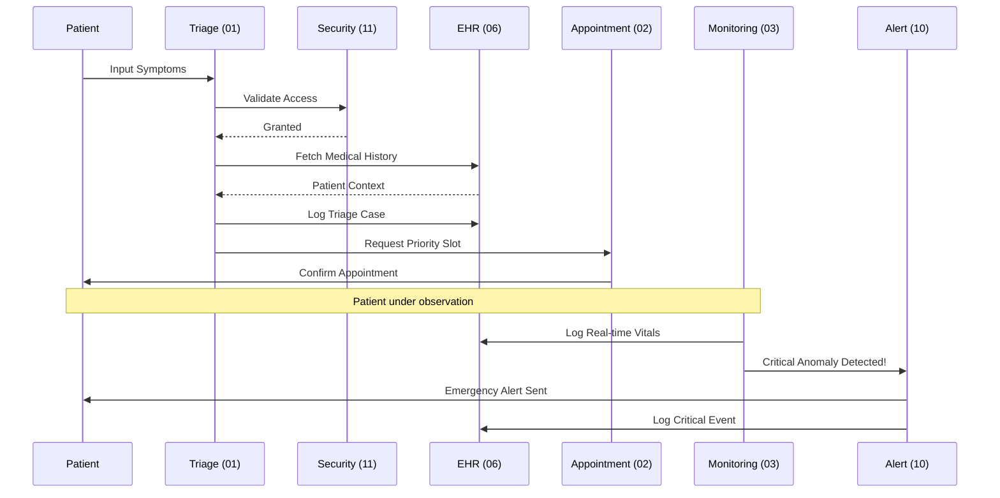

# 🏗️ ClinicAI Architectural Blueprint

This document illustrates the high-level architecture and data flow of the 12-agent ClinicAI ecosystem.

---

## 1. System Architecture Diagram
The diagram below shows how the agents are grouped by responsibility and how they interact with the central **Data (EHR)** and **Security** layers.

```mermaid
graph TB
    subgraph "External Access"
        Portal[12: Patient Portal]
        Assistant[08: Chat Assistant]
    end

    subgraph "Clinical Workflow"
        Triage[01: Symptom Triage] --> Appt[02: Appointment Scheduler]
        Appt --> Monitor[03: Continuous Monitoring]
        Monitor --> Risk[04: Predictive Risk]
        Risk --> Support[05: Decision Support]
    end

    subgraph "Urgency & Alerting"
        Monitor --> Alert[10: Emergency Alert]
        Triage --> Alert
        Assistant --> Alert
    end

    subgraph "Core Infrastructure"
        Security[11: Security & Compliance]
        EHR[06: Smart EHR]
    end

    subgraph "Strategy & Analytics"
        Analytics[09: Population Analytics]
    end

    %% Security Intercepts
    External Access -.-> Security
    Clinical Workflow -.-> Security
    Security -.-> EHR
    
    %% Data Persistence
    Clinical Workflow --> EHR
    Analytics <-- EHR
    Medication[07: Med Mgmt] --> EHR
```

---

## 2. Patient Journey Flow Chart
This chart tracks the lifecycle of a patient request through the ecosystem.



---

## 3. Component Responsibility Matrix

| Layer | Agents | Focus |
| :--- | :--- | :--- |
| **Edge** | 08, 12 | Interaction, UX, and Notifications. |
| **Logic** | 01, 02, 07 | Clinical workflows and scheduling. |
| **Intelligence** | 03, 04, 05, 09 | AI Inference (Monitoring, Risk, Analytics). |
| **Backbone** | 06, 10, 11 | Data, Emergency Response, and Security. |
